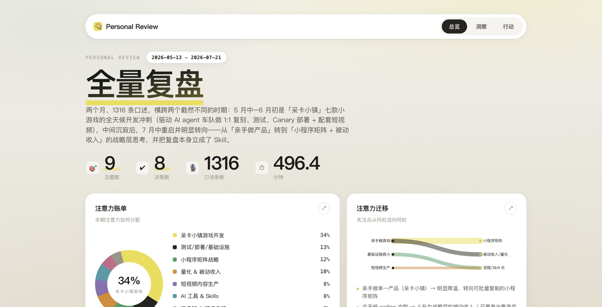

# Personal Review · Typeless 语音记录复盘 Skill

把 [Typeless](https://typeless.now/) 永久保存在本地的全部语音口述记录，一键变成一份**图示化的个人复盘报告**——看清你最近一段时间的注意力去了哪、在反复纠结什么、做了哪些决定、哪些想法悬而未决。

**通用工具，不绑定某个 AI**——支持 [Claude Code](https://claude.com/claude-code)、
[Codex](https://openai.com/codex/)，以及任意能读写文件、跑命令的 AI agent。

<p align="center">
  
</p>

## 它能给你什么

报告分三个 tab：

- **总览** — 注意力账单（各主题占比）· 注意力迁移（关注点从什么流向什么）· 工具/场景分布
- **洞察** — 重复问题 & 可沉淀 SOP · 情绪/精力信号 · 未闭环问题追踪（别让好想法被遗忘）
- **行动** — 决策记忆 · 项目动量（上升/平稳/停滞）· 本周建议（完成/停止/决策）

所有洞察都由 AI 阅读你的口述内容语义聚类得出，并引用真实记录；活跃统计与工具分布则是确定性计算，不会被"脑补"。

## 安装

**一行命令（推荐）** —— 装进当前项目，`cd` 到目标项目再跑：

```bash
cd your-project
npx typeless-personal-review install
```

一条命令搞定，不问 agent。skill 会同时装进**当前项目**的三个 skill 目录，
再给 Claude Code / Codex 各装一个 `/personal-review` slash command——跟随项目走，不碰家目录：

| 装的东西 | 位置 | 谁用它 |
|---|---|---|
| skill | `./.claude/skills/personal-review/` | Claude Code |
| skill | `./.codex/skills/personal-review/` | Codex、Kimi CLI（也 fallback 读这里） |
| skill | `./.agents/skills/personal-review/` | GLM / MiniMax 及其它兼容 runtime 的通用约定 |
| slash 命令 | `./.claude/commands/`、`./.codex/commands/` | Claude Code / Codex 的 `/personal-review` |

三处装同一份 skill，无论用哪个 agent 都能读到。换一个项目要用，就在那个项目里再装一次。

> 装的是隐藏目录（`.` 开头），Finder 默认看不见——`ls -la` 或在编辑器里可以看到。

**也可以**手动把 skill 放进某个项目：

```bash
git clone https://github.com/JamesRRR/typeless-personal-review.git
cp -R typeless-personal-review/skills/personal-review your-project/.claude/skills/
```

> 前置：本机装了 Typeless 桌面版并已有一些语音记录（数据在
> `~/Library/Application Support/Typeless/typeless.db`）；Node 16+（跑 npx 用）；
> Python 3（用系统自带的即可，无第三方依赖）。

## 使用

在装了它的那个项目里打开你的 agent（Claude Code / Codex / Kimi / GLM / MiniMax…），
说一句「帮我做一下这周的 personal review」即可。Claude Code 里也可以用 slash command：

```
/personal-review            # 默认最近一周
/personal-review month      # 最近一个月
/personal-review all        # 全量
```

底层就三个命令，任何 agent 都能调：

```bash
typeless-personal-review collect --range week      # 读本地库 → corpus + stats
# （agent 读 corpus，按 analysis-guide 出 insights.json）
typeless-personal-review render insights.json --open   # → 自包含 HTML 报告
```

产出一个自包含的图示化 HTML 报告（Claude 版还能发成可分享的 Artifact）。报告是你的私人数据，只在本地。

## 工作原理

```
Typeless SQLite 库
      │  collect.py（只读，唯一的 DB 读取者，纯 stdlib）
      ▼
corpus.jsonl（清洗去重的口述语料）+ stats.json（确定性聚合）
      │  Claude 按 references/ 的规则做语义聚类
      ▼
insights.json（固定 schema，10+ 节洞察）
      │  注入 assets/report-template.html（数据驱动、自包含、跟随明暗主题）
      ▼
图示化 HTML 报告 + markdown 镜像
```

- **collector 是唯一读库的地方**，只读打开，不与运行中的 Typeless 争锁。
- **语义与渲染解耦**：`insight-schema.json` 是固定接口，改版式只动模板，不动数据逻辑。
- **确定性数据不脑补**：工具/场景分布等直接来自 SQL 聚合。

## 目录结构

```
skills/personal-review/
├── SKILL.md                       # 工作流与触发词
├── scripts/collect.py             # 确定性 collector（纯 stdlib）
├── assets/report-template.html    # 自包含、跟随主题的 3-tab 报告模板
├── references/
│   ├── insight-schema.json        # 洞察数据的固定接口
│   └── analysis-guide.md          # 每节的语义聚类规则
└── evals/evals.json               # 测试用例
```

## 隐私

你的 Typeless 记录是高度私人的数据。这个 Skill **完全在本地运行**，collector 只读你自己机器上的库；生成的报告是私有的，只有你主动分享才会公开。仓库里不包含任何个人数据。

## License

MIT
